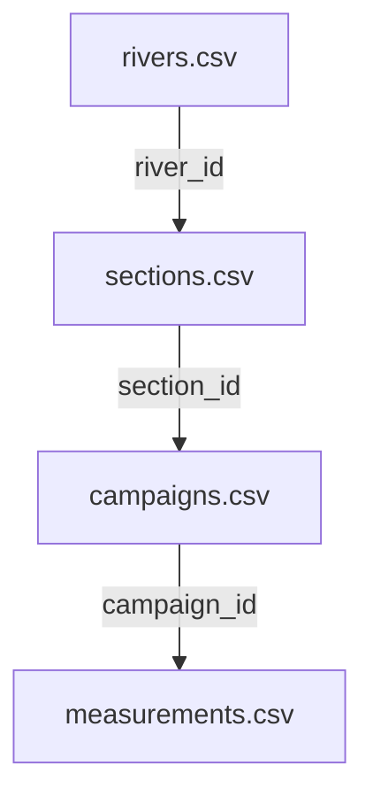

# 🌊 Global Bedload Observatory

**Worldwide bedload transport measurement database**

A collaborative and standardized database to centralize bedload transport measurements from rivers around the world.

---

🚀 Quick Access
🌐 Interactive Explorer: https://geomorphbars.github.io/Global_Bedload_Observatory/
Explore measurement sites on an interactive map, view detailed data, charts, and download datasets.

---

## 📋 Table of Contents

- [Overview](#overview)
- [Database Structure](#database-structure)
- [Installation and Usage](#installation-and-usage)
- [Data Format](#data-format)
- [Validation Scripts](#validation-scripts)
- [Visualization Interface](#visualization-interface)
- [Contributing](#contributing)
- [Documentation](#documentation)

---

## 🎯 Overview

This database allows you to:
- ✅ Centralize bedload measurements from different sources
- ✅ Standardize data according to a common format
- ✅ Support 4 main measurement methods
- ✅ Visualize and explore data interactively
- ✅ Export data for analysis

### Supported Measurement Methods

1. **Passive acoustic** (hydrophones)
2. **Active acoustic** (ADCP)
3. **Physical sampling** (Helley-Smith, etc.)
4. **Dune tracking** (repeated bathymetry)

---

## 🗂️ Database Structure

The database is organized hierarchically into 4 tables:

```
RIVERS (Rivers)
    └── SECTIONS (Measurement reaches)
            └── CAMPAIGNS (Field campaigns)
                    └── MEASUREMENTS (Individual measurements)
```

### CSV Files

| File | Description | Columns | Required |
|---------|-------------|----------|--------------|
| `rivers.csv` | List of rivers | 5 | 3 |
| `sections.csv` | Instrumented reaches | 10 | 5 |
| `campaigns.csv` | Measurement campaigns | 7 | 3 |
| `measurements.csv` | Bedload measurements | 27 | 4 |

### Relationships Between Tables



---

## 🚀 Installation and Usage

### Prerequisites

- Python 3.8+
- Modern web browser (for interface)

### Install Python Dependencies

```bash
pip install pandas numpy
```

### Complete Workflow

#### 1. Download Templates

Template files contain examples and detailed instructions:

```
data/
├── template_rivers.csv
├── template_sections.csv
├── template_campaigns.csv
└── template_measurements.csv
```

#### 2. Fill in Data

Rename templates (remove `template_`) and fill with your data:

```
data/
├── rivers.csv
├── sections.csv
├── campaigns.csv
└── measurements.csv
```

**⚠️ Important:** Delete all instruction lines (starting with `#`)

#### 3. Validate Data

```bash
python scripts/validate.py
```

The script checks:
- ✅ File structure
- ✅ Required fields
- ✅ Referential integrity
- ✅ Formats (dates, coordinates, emails)
- ✅ Authorized values
- ✅ Data consistency

**Expected result:**
```
✅ ALL VALIDATIONS PASSED!

📊 Statistics:
Rivers: 4
Sections: 6
Campaigns: 10
Measurements: 15

📈 Method distribution:
  - passive_acoustic: 5
  - active_acoustic: 4
  - physical_sampler: 3
  - dune_tracking: 3

🌍 Countries: FRA, USA, CHE
```

#### 4. Build SQLite Database

```bash
python scripts/build_database.py
```

Generates:
- `bedload_transport.db` - SQLite database with indexes
- Displays construction statistics

#### 5. Visualize Data

Open `explorer.html` in a browser to access the interactive interface.

---

## 📊 Data Format

### RIVERS.CSV - Rivers

**Required columns:**
- `river_id` - Unique identifier (e.g., ARC_FR)
- `river_name` - River name (e.g., Arc)
- `country` - ISO 3-letter country code **UPPERCASE** (e.g., FRA)

**Optional columns:**
- `watershed_area_km2` - Watershed area
- `notes` - Additional notes

---

### SECTIONS.CSV - Reaches

**Required columns:**
- `section_id` - Unique identifier (e.g., ARC_BSM)
- `river_id` - Link to rivers.csv
- `section_name` - Reach name (e.g., Bourg-Saint-Maurice)
- `latitude` - Decimal latitude WGS84 (-90 to 90)
- `longitude` - Decimal longitude WGS84 (-180 to 180)

**Optional columns:**
- `elevation_m` - Elevation (m)
- `bankfull_width_m` - Bankfull width (m) ⭐
- `channel_slope` - Channel slope (0-1)
- `morphology_type` - Morphological type
- `notes` - Additional notes

**⚠️ Important:** Use `bankfull_width_m` (constant morphological width), not `section_width_m`

---

### CAMPAIGNS.CSV - Campaigns

**Required columns:**
- `campaign_id` - Unique identifier (e.g., ARC_BSM_2023_06)
- `section_id` - Link to sections.csv
- `campaign_date` - Date in **YYYY-MM-DD** format

**Optional columns:**
- `data_provider` - Data provider
- `contact_email` - Contact email
- `reference` - Publication reference
- `notes` - Additional notes

---

### MEASUREMENTS.CSV - Measurements ⭐

**The most complex file with 27 columns**

#### Required columns (4)

| Column | Description | Example |
|---------|-------------|---------|
| `measurement_id` | Unique ID | MEAS_001 |
| `campaign_id` | Link to campaign | ARC_BSM_2023_06 |
| `measurement_method` | Method (see below) | passive_acoustic |
| `bedload_rate_total_kg_s` | Total flux (kg/s) | 0.156 |

**Authorized methods:**
- `passive_acoustic`
- `active_acoustic`
- `physical_sampler`
- `dune_tracking`

#### Optional general columns (9)

| Column | Description | Recommended |
|---------|-------------|------------|
| `discharge_m3_s` | Discharge (m³/s) | ⭐⭐⭐ |
| `discharge_source` | Discharge source | ⭐⭐ |
| `discharge_station_code` | Station code | - |
| `discharge_station_name` | Station name | - |
| `d50_mm` | Median diameter (mm) | ⭐⭐⭐ |
| `d84_mm` | D84 (mm) | ⭐ |
| `d10_mm` | D10 (mm) | ⭐ |
| `water_depth_mean_m` | Mean depth (m) | ⭐ |
| `flow_velocity_mean_m_s` | Mean velocity (m/s) | ⭐ |

**Discharge sources (discharge_source):**
- `hydrometric_station` - Gauging station (fill code and name)
- `adcp_measurement` - Measured with ADCP
- `rating_curve` - Rating curve
- `current_meter` - Current meter
- `model` - Hydrological model
- `estimated` - Estimated
- `other` - Other

#### Method-specific columns (14)

**⚠️ Fill ONLY the columns for the method used**

##### 🎤 PASSIVE_ACOUSTIC (6 columns)
- `acoustic_hydrophone_type` - Hydrophone type
- `acoustic_recorder_type` - Recorder type
- `acoustic_sensitivity_db` - Sensitivity (dB)
- `acoustic_calibration` - Equation (Nasr_2023, Le_Guern_2024, other)
- `acoustic_calibration_a` - Parameter a (if other)
- `acoustic_calibration_b` - Parameter b (if other)

##### 📡 ACTIVE_ACOUSTIC (3 columns)
- `adcp_type` - ADCP type
- `adcp_equation_type` - Equation used
- `adcp_measurement_duration_s` - Measurement duration (s)

##### 🪣 PHYSICAL_SAMPLER (1 column)
- `sampler_type` - Sampler type (e.g., Helley-Smith 76mm)

##### 🏔️ DUNE_TRACKING (4 columns)
- `dune_survey_method` - Survey method
- `dune_echosounder_type` - Echosounder type (single_beam, multibeam)
- `dune_equation_type` - Transport equation
- `dune_interval_hours` - Interval between surveys (h)

---

## 🔍 Validation Scripts

### validate.py

Validates the structure and content of CSV files.

**Usage:**
```bash
python scripts/validate.py
```

**Checks performed:**

✅ **Structure**
- Required files present
- Required columns present
- Correct CSV format

✅ **Referential integrity**
- All `river_id` in sections exist in rivers
- All `section_id` in campaigns exist in sections
- All `campaign_id` in measurements exist in campaigns

✅ **Formats**
- Dates in YYYY-MM-DD format
- Coordinates within limits (-90/90, -180/180)
- Valid emails
- Country codes in 3 uppercase letters

✅ **Authorized values**
- `measurement_method` among 4 authorized values
- `discharge_source` among 7 authorized values
- `acoustic_calibration` among authorized values
- `dune_echosounder_type` among authorized values

✅ **Consistency**
- Grain size: d10 < d50 < d84
- Station code/name filled only if source = hydrometric_station
- Calibration a,b filled only if calibration = other

**Output:**
```
✅ ALL VALIDATIONS PASSED!

📊 Statistics:
...

⚠️ Warnings (optional fields):
- 3 measurements missing discharge_m3_s
- 2 measurements missing d50_mm
```

---

### build_database.py

Builds the SQLite database from validated CSVs.

**Usage:**
```bash
python scripts/build_database.py
```

**Actions:**
1. Deletes old database if it exists
2. Creates SQL schema with foreign keys
3. Loads CSV data in hierarchical order
4. Creates indexes to optimize queries
5. Displays statistics

**Output:**
```
🗄️  Building SQLite database...

✅ Database created: bedload_transport.db

📊 Database statistics:
Rivers: 4
Sections: 6
Campaigns: 10
Measurements: 15

📈 Method distribution:
  - passive_acoustic: 5 (33%)
  - active_acoustic: 4 (27%)
  - physical_sampler: 3 (20%)
  - dune_tracking: 3 (20%)

🌍 Countries: FRA, USA, CHE
```

---

## 🖥️ Visualization Interface

### explorer.html

Interactive web interface to explore the database.

**Features:**

#### 📍 Map Tab

**Interactive map:**
- Clustered markers for all sections
- Click marker → Section details

**Dynamic filters:**
- 🌍 Country (1st filter)
- 🏞️ River
- 📍 Section
- 🔬 Method
- 📅 Date Range (From / To)

**Cascading filters:**
- Select Country → Rivers filtered
- Select River → Sections filtered
- etc.

**Automatic zoom:**
- Zoom on filtered sites
- Automatic zoom level adaptation

**Section details:**
- General information
- Charts (Flux vs Discharge, Temporal evolution)
- Measurements table
- CSV/JSON export

#### 📊 Browse All Data Tab

**Complete table:**
- All measurements with columns:
  - River, Section, Country, Date
  - Method, Flux, Discharge
  - Source, d50, d10-d84

**Same filters as Map:**
- Country, River, Section, Method, Date
- Filtered measurements counter

**Export:**
- CSV
- JSON

#### 📈 Global Charts Tab

**Global charts:**
- Distribution by method
- Distribution by country
- Temporal evolution
- Flux vs Discharge (all data)

---

## 🤝 Contributing

### Add Your Data

1. **Download templates** from `docs/`
2. **Fill with your data** following the format
3. **Validate** with `python scripts/validate.py`
4. **Submit** via pull request or direct contact

### Contribution Format

For each contribution, provide:
- Completed CSV files
- Data provider information
- Publication reference if applicable
- Quality metadata

### Quality Standards

✅ **Minimum required data:**
- Bedload flux (bedload_rate_total_kg_s)
- Measurement method
- GPS location
- Measurement date

✅ **Highly recommended data:**
- Water discharge (discharge_m3_s)
- Grain size d50 (d50_mm)
- Discharge source
- Method parameters

---

## 📚 Documentation

### Available Guides

| Document | Description |
|----------|-------------|
| `GUIDE_FILLING_CSV.md` | Detailed guide for filling CSV files |
| `GUIDE_STRUCTURE_DATABASE.md` | Complete database structure (tables, columns, formats) |
| `template_*.csv` | Templates with examples and instructions |

### Quick Access

**Table structure:**
```bash
# See GUIDE_STRUCTURE_DATABASE.md
```

**CSV filling:**
```bash
# See GUIDE_FILLING_CSV.md
# OR consult instructions in template_*.csv
```

---

## 📞 Contact

**For questions or contributions:**
- Consult documentation in `/docs`
- Use CSV templates (contain instructions)
- Run validation scripts

---

## 🔄 Changelog

### Version 2.0 (February 2026)
- ✅ Added `bankfull_width_m` column in sections
- ✅ Added `discharge_source`, `discharge_station_code`, `discharge_station_name`
- ✅ Added `d10_mm` for complete grain size
- ✅ Support for `active_acoustic` method
- ✅ Web interface with cascading filters
- ✅ Automatic zoom on selection
- ✅ Simplified campaigns (7 columns)

### Version 1.0 (Initial)
- ✅ Basic 4-table structure
- ✅ Support for 3 methods (passive, sampler, dune)
- ✅ Validation and build scripts
- ✅ Basic interface

---

## 📜 License

[To be defined according to your needs]

---

## 🙏 Acknowledgments

This database is the result of collaboration between researchers and practitioners in sediment transport.

---

**Last update: February 2026**
